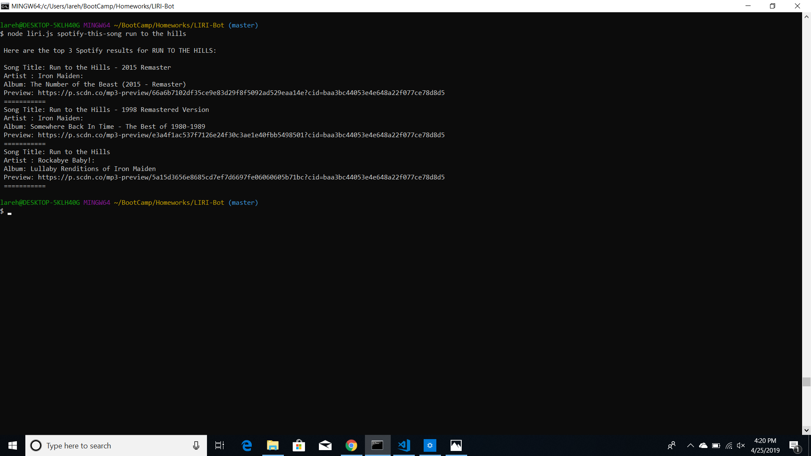
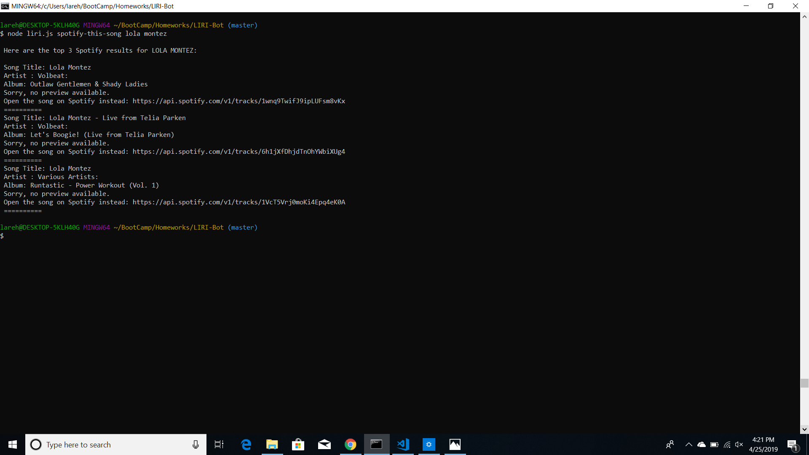
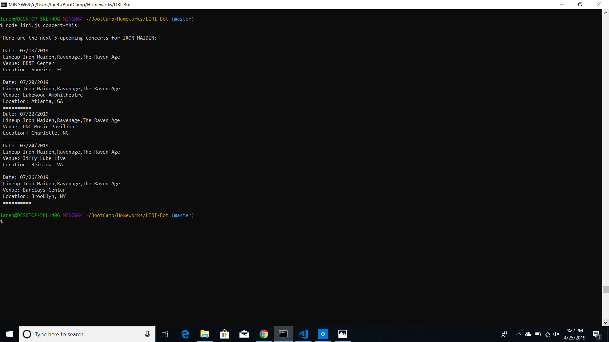
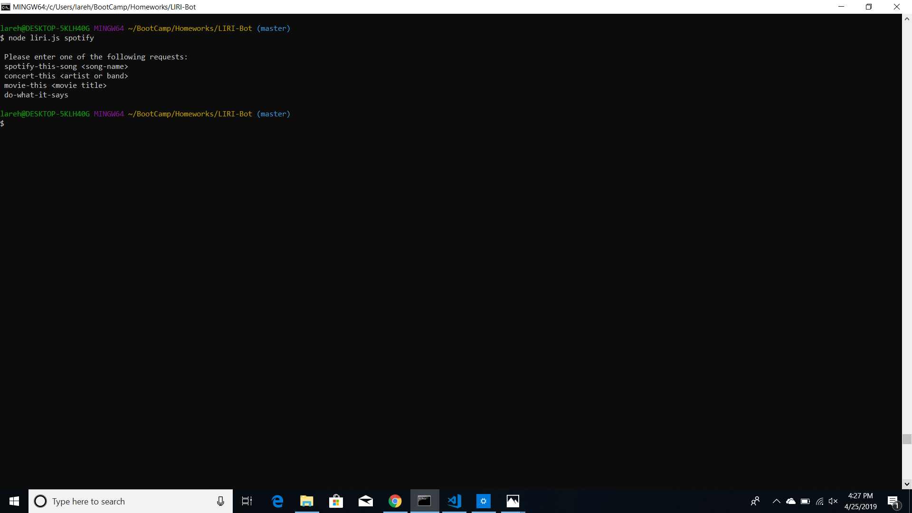

##### LIRI-Bot
LIRI (Language Interpretation and Recognition Interface) is a command line node app that takes in parameters and returns data.
Available parameters for LIRI are:
- spotify-this-song 
- concert-this 
- movie-this movie
- do-what-it-says

**Note** *After cloning the repository, you must supply your own .env file containing your Spotify API keys and run npm install in order for LIRI to run properly*

##How to Use LIRI

#spotify-this-song

Command line entry: spotify-this-song run to the hills.
LIRI returned the song Title, Artist, Album and a preview link for the top 3 Spotify search results for Run To The Hills.

Command line entry: spotify-this-song  
Because we did not enter a song name LIRI will run a default Spotify search for The Sign by Ace of Base.

Command line entry: spotify-this-song lola montez.
Some of the returned results have no preview available, so LIRI gave us a link to open the song on Spotify instead.

#concert-this

Command line entry: concert-this papa roach
LIRI returned the Date, Lineup, Venue, and Location for 5 upcoming Papa Roach concerts.

Command line entry: concert-this
Since we did not enter an artist or band, LIRI will run the search with a default value of Iron Maiden because everyone should know when and where they can see Iron Maiden.

#movie-this

Command line entry: movie-this rocky horror
LIRI returned the Title, Rating, Year, IMDB Rating, Rotten Tomatoes Score, Country, Language, Plot, and Actors for the Rocky Horror Picture Show.

Command line entry: movie-this
If we leave the movie name blank, LIRI runs a default search and returns the information for Mr. Nobody.

#do-what-it-says

Command line entry: do-what-it-says
In this case, LIRI reads the random.txt file and takes that information as its parameters. Since the random.txt file says "spotify-this-song, I Want It That Way", LIRI runs a Spotify search for I Want It That Way.

#Accounting for Other Input

Command line entry: spotify
Since spotify isn't one of LIRI's recognized parameters, LIRI returns a list of possible commands.

Command line entry: MOVIE-THIS THE LION KING
LIRI is able to recognize possible commands even if the input is not all lowercase and will still perform the proper search.

#Technologies Used
- NodeJS
- JavaScript
- npm dotenv
- npm axios
- npm node-spotify-api
- npm moment
- npm word-wrap
- Spotify API
- Bandsintown API
- OMDB API

#Author 
Lara Eller
